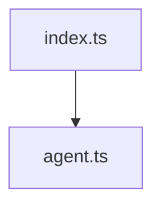

# 在 VitePress 里做 Mermaid 渲染与图表查看器

这篇文章从技术分享的角度，完整讲一下 `docs-site` 里 Mermaid 支持是怎么做出来的。

最后落地的能力有两部分：

- Markdown 里的 ```` ```mermaid ```` 代码块会直接渲染成图
- 图表支持放大、缩小、重置、拖拽，以及主题切换后的稳定重绘

如果只看一句总结，这套方案的核心思路是：

**让 Markdown 层只负责“识别 Mermaid”，让 Mermaid 只负责“产出 SVG”，再由组件层补上查看体验。**

---

## 一、我们真正要解决的是什么问题

最开始的问题看起来很简单：VitePress 默认不会把 Mermaid 代码块渲染成图。

比如文档作者写：

```md

```

默认效果只是一个普通代码块，而不是图表。

但真开始做时，问题其实有两层：

### 1. 基础渲染问题

我们希望作者继续写标准 Mermaid fenced code block，而不是改成：

- 手写 Vue 组件
- 额外套容器语法
- 在 Markdown 里写一堆前端细节

也就是说，作者体验必须保持简单。

### 2. 阅读体验问题

即使 Mermaid 成功渲成 SVG，也不代表阅读体验就合格。

文档里的图经常会遇到这些情况：

- 图比较大，默认只能看见一部分
- 图比较复杂，用户想放大看细节
- 图比较宽，小屏幕下很难读
- 明暗主题切换后，图颜色不对
- 同一页多张图时，容易互相影响

所以这次实现不是“把图显示出来”就结束，而是要把图做成一个可用的查看区域。

---

## 二、为什么不直接照搬 GitHub

这是当时最容易出现的一个误区。

GitHub 上 Mermaid 的体验确实很成熟，尤其是图表右下角的交互按钮，会让人直觉上觉得：  
“那我们是不是应该直接做成和 GitHub 一样？”

后来把这个问题拆开看，结论其实很明确：

**不需要做成和 GitHub 一模一样，但应该借鉴 GitHub 的分层思路。**

原因有三个。

### 1. GitHub 解决的是平台级问题

GitHub 的场景是通用内容平台，要处理：

- 各种来源的用户内容
- 更复杂的安全约束
- 评论区、README、Issue、PR 等不同容器
- 大规模一致性体验

而 `docs-site` 是一个自控文档站，输入来源和运行环境都简单得多。

### 2. 我们真正缺的不是“渲染引擎”

当前这类需求里，Mermaid 本体已经足够负责“从语法到 SVG”。

和 GitHub 的体验差距，主要不在 Mermaid，而在图渲染完以后：

- 有没有查看器
- 能不能缩放
- 能不能拖拽
- 切主题会不会重绘

所以重点应该是补“图表查看层”，不是推翻 Mermaid 渲染链路。

### 3. 追 GitHub 等价实现，成本不值

你拿不到 GitHub 的完整内部实现细节。  
硬追等价，最后往往会把范围做大，但收益只是在“更像 GitHub”。

对于文档站，这个投入不划算。

所以最终定下来的方向是：

- Mermaid 继续负责生成 SVG
- VitePress 继续负责 Markdown 到页面的接入
- 我们自己在组件层补一个轻量查看器

这个取舍比“完全复刻 GitHub”更稳，也更适合当前体量。

---

## 三、整体方案怎么拆

最后实现拆成了三层：

### 1. Markdown 接入层

文件：`docs-site/.vitepress/config.ts`

这层只做一件事：拦截 `mermaid` 代码块。

关键逻辑是：

```ts
md.renderer.rules.fence = (tokens, idx, options, env, self) => {
	const token = tokens[idx];
	const lang = token.info.trim().split(/\s+/u)[0];

	if (lang === "mermaid") {
		const code = Buffer.from(token.content, "utf8").toString("base64");
		return `<MermaidBlock code="${code}" />`;
	}

	return fence(tokens, idx, options, env, self);
};
```

这里有两个要点。

第一，只处理 `lang === "mermaid"` 的代码块。  
其他代码块完全不受影响，继续走 VitePress 默认高亮。

第二，Mermaid 源码不是直接塞进属性，而是先转成 Base64。

这是因为 Mermaid 源码里经常会有：

- 换行
- 引号
- 尖括号
- 中文

如果直接塞进 HTML 属性，很容易遇到转义问题。  
先 Base64，再在组件里解码，是最省心的接法。

### 2. 主题注册层

文件：`docs-site/.vitepress/theme/index.ts`

这层很薄，只负责注册组件：

```ts
import DefaultTheme from "vitepress/theme";
import MermaidBlock from "./MermaidBlock.vue";

export default {
	extends: DefaultTheme,
	enhanceApp(ctx) {
		DefaultTheme.enhanceApp?.(ctx);
		ctx.app.component("MermaidBlock", MermaidBlock);
	},
};
```

Markdown 层输出的是 `<MermaidBlock />`，这一层把它真正连到 Vue 组件上。

### 3. 图表组件层

文件：`docs-site/.vitepress/theme/MermaidBlock.vue`

这层是真正的核心。

它负责：

- 解码 Markdown 传进来的 Mermaid 源码
- 调用 Mermaid 生成 SVG
- 给 SVG 套查看器
- 处理缩放、拖拽、重置
- 处理主题切换、路由切换、窗口尺寸变化
- 处理错误状态

所以如果只看职责划分，可以这么理解：

- `config.ts` 负责“把 Mermaid 代码块识别出来”
- `theme/index.ts` 负责“把组件挂进主题”
- `MermaidBlock.vue` 负责“把图真正渲出来，并让它好用”

---

## 四、为什么 Mermaid 只负责产 SVG

这是这套方案最重要的边界之一。

完整链路是这样：

1. Markdown 中写 ` ```mermaid `
2. `config.ts` 把代码块改写成 `<MermaidBlock code="..." />`
3. `MermaidBlock.vue` 解码 `code`
4. 调用 `mermaid.render(id, source)` 生成 SVG
5. 把 SVG 插进组件容器
6. 再给这个 SVG 套上 viewer 能力

换句话说：

- Mermaid 只负责“图长什么样”
- viewer 负责“图怎么被看”

这样拆有一个很大的好处：

**渲染和交互不会耦合在一起。**

如果后面你要：

- 换缩放库
- 增加全屏查看
- 调整工具栏
- 改滚轮策略

都不需要去改 Mermaid 的接法。

---

## 五、第一批坑：同页多图会串图

这是实际落地时第一个比较隐蔽的问题。

最开始的写法里，Mermaid 的 render id 不是全局唯一的，结果同一页两张图会用到重复的内部 SVG 定义。

你表面上看到的现象是：

- 两张图重叠
- 箭头错位
- 第一张图“吃掉”第二张图的一部分元素

根因是 Mermaid 生成的 SVG 里不只是可见节点，还会生成很多内部引用，例如：

- `marker`
- `clipPath`
- `path`
- 各种内部 id

如果不同图的前缀重复，这些定义就会互相污染。

后来修复方式很直接：

```ts
const instanceId = `mermaid-${crypto.randomUUID()}`;
const renderCount = ref(0);

const id = `${instanceId}-${renderCount.value++}`;
```

这样做之后：

- 每个组件实例有自己独立的随机前缀
- 每次重绘再叠加递增计数

最终每张图的 render id 都是唯一的。

这个问题很值得单独记一下，因为它不是语法错，也不是样式错，而是**SVG 内部定义冲突**。  
如果只盯着页面外观，很容易误判方向。

---

## 六、为什么还要额外加一个查看器

Mermaid 能渲成 SVG，不代表图就好看、好读。

比如下面这些场景，光有 SVG 根本不够：

- 图比容器大，默认只能看到左上角
- 图很多节点，想放大看文字
- 小屏下图被压得太小
- 用户只是想快速看某个局部

所以后面补了一层 viewer。

这次选的是 `@panzoom/panzoom`。

依赖是显式加到 `docs-site/package.json` 里的：

```json
{
	"devDependencies": {
		"@panzoom/panzoom": "^4.6.2",
		"mermaid": "^11.14.0"
	}
}
```

这里故意没有偷 Mermaid 依赖树里的传递依赖，而是单独声明。

原因是：

- 依赖关系更清楚
- 升级 Mermaid 时不依赖内部实现细节
- 缩放逻辑和 Mermaid 渲染逻辑的版本边界更清晰

---

## 七、viewer 这一层到底做了什么

组件结构不是“一个 div 塞 SVG”，而是下面这三层：

1. `mermaid-viewer`
2. `mermaid-viewport`
3. `mermaid-stage`

分别对应：

- `viewer`：整个图表区域
- `viewport`：可视窗口，负责裁切、边框和交互边界
- `stage`：真正承载 SVG 的舞台，Panzoom 作用在这里

工具栏和 `viewport` 同级，固定在右下角。

### 当前支持的交互

- 放大
- 缩小
- 重置
- 鼠标拖拽
- 触控板 / 移动端双指缩放

### 当前没做的交互

- 全屏
- 导出图片
- 键盘快捷键
- 缩略图导航

这个边界是有意收窄的。  
文档站最核心的是“图能被舒服地看清”，不是做成一个复杂画布应用。

---

## 八、重置为什么不是“回到原始尺寸”

这也是实现里一个比较重要的产品语义。

如果你只是调用 Panzoom 的默认 reset，很容易把图还原到一种并不好读的状态。

因为用户真正想要的，通常不是“回 SVG 原始尺寸”，而是：

**回到刚进入页面时那个最适合阅读的默认视图。**

所以当前做法不是把 `reset` 理解成“1:1”，而是先自己算一个初始适配视图：

1. 先读 SVG 尺寸，优先用 `viewBox`
2. 根据视口宽高和 padding 算一个 fitted scale
3. 算 `startX` / `startY` 把图居中
4. 把这组值写回 Panzoom 的 `startScale / startX / startY`
5. `reset` 时回到这组值

核心代码类似这样：

```ts
const fittedScale = Math.min(availableWidth / width, availableHeight / height, 1);
const startX = (viewport.value.clientWidth / nextInitialScale - width) / 2;
const startY = (viewport.value.clientHeight / nextInitialScale - height) / 2;

panzoom.setOptions({
	startScale: nextInitialScale,
	startX,
	startY,
});
panzoom.reset({ animate: false, force: true });
```

这样之后，`重置` 的体验会更符合直觉。

---

## 九、为什么滚轮缩放不能无条件开启

这是 viewer 里另一个很实际的问题。

如果你把滚轮缩放直接绑上，马上会和页面滚动打架。

典型场景是：

- 用户本来只是想继续往下看文档
- 鼠标刚好停在图上
- 结果页面没滚，图突然开始缩放

这个体验很差。

所以当前实现里，滚轮不是默认强接管的，而是加了一个条件：

```ts
const hasModifier = event.ctrlKey || event.metaKey;
const hasActiveZoom = Math.abs(currentScale.value - initialScale.value) > SCALE_EPSILON;

if (!panzoom || (!hasModifier && !hasActiveZoom)) {
	return;
}
```

含义是：

- 正常阅读文档时，页面滚动优先
- 如果用户已经在放大状态里继续微调，允许滚轮缩放
- 如果用户明确按住 `Ctrl / Command`，也允许滚轮缩放

这不是最激进的交互方案，但它更适合文档站。

---

## 十、第二批坑：路由切换、主题切换、尺寸变化

如果只做首次渲染，页面一开始看起来可能没问题。  
但一旦开始真实使用，很快就会碰到下面这些问题。

### 1. 路由切回来后图失效

如果旧的 viewer 实例没有清理：

- 按钮可能不工作
- 事件会重复绑定
- 状态可能串到下一次渲染里

### 2. 主题切换后配色不对

Mermaid 的深浅主题不是纯 CSS 能解决的。  
很多情况下要重新执行一遍 Mermaid 渲染，才能得到正确的 SVG 配色。

### 3. 窗口尺寸变化后初始化视图失真

例如：

- 浏览器窗口变窄
- 侧边栏布局变化
- 移动端切换方向

这时原来的 fitted scale 已经不对了。

所以组件里专门做了这些监听：

```ts
watch(() => route.path, scheduleRender);
watch(() => isDark.value, scheduleRender);
watch(() => props.code, scheduleRender);
```

再加上：

- `ResizeObserver`
- 渲染前清理旧实例
- 解绑 wheel / panzoomchange 事件
- 断开 observer
- 取消未执行的动画帧

也就是说，这个组件的稳定性并不是只靠“重新 render 一下”，而是靠**先清干净，再重建**。

---

## 十一、错误态为什么要保留

技术上你完全可以在 Mermaid 渲染失败时什么都不显示。

但在文档场景里，这会让问题非常难查。

所以当前错误态是显式展示的：

- 标题：`Mermaid 渲染失败`
- 下面直接输出错误信息

错误态下不会再初始化 viewer，也不会影响页面其他内容。

这个细节虽然简单，但很重要，因为它直接决定了文档作者排错时的效率。

---

## 十二、样式层面有哪些取舍

这一层我们没有把它当成“设计一个复杂组件”，而是围绕阅读体验做了几个关键约束。

### 1. `viewport` 负责可视边界

- 有背景
- 有边框
- 有圆角
- 超出区域裁切

### 2. `stage` 固定 `transform-origin: 0 0`

这样 Panzoom 的坐标体系比较稳定，不容易出现缩放中心错乱。

### 3. SVG 不再使用 `max-width: 100%`

如果 SVG 还被外层 CSS 自动压缩，Panzoom 的缩放计算很容易失真。  
所以这里让 SVG 交给 viewer 控制，不再让响应式图片样式插手。

### 4. 工具栏固定右下角

按钮始终在图区域右下角，位置稳定，用户成本最低。

---

## 十三、这套方案到底值不值得

从结果看，这套实现解决了 4 类关键问题：

### 1. 作者体验稳定

文档作者还是只写标准 Mermaid fenced code block，不需要知道前端实现细节。

### 2. 技术边界清楚

- Markdown 层只处理接入
- Mermaid 只处理渲染
- viewer 只处理交互

后续维护不会很混乱。

### 3. 阅读体验明显提升

不是简单“能看到图”，而是：

- 能看全
- 能放大
- 能拖拽
- 能重置

### 4. 常见稳定性问题已经处理掉

- 同页多图不串图
- 主题切换能重绘
- 路由切换回来不失效
- Mermaid 语法错时能看到报错

所以如果站在文档站的角度看，这已经不是一个“勉强能用”的接法，而是一套比较完整、边界也比较健康的实现。

---

## 十四、还有哪些事可以继续做

这套方案已经够用，但也确实还有几个自然延伸的方向：

1. 把这篇文章挂进 sidebar，作为正式的实现分享页
2. 增加全屏查看
3. 增加“适配宽度 / 原始比例”切换
4. 抽出 `useMermaidViewer()`，减轻组件体积
5. 做更细的 Mermaid 主题定制

但这些都应该建立在当前这版稳定之后，而不是一开始就把范围做大。

---

## 十五、回看这次实现，最值得记住的几点

如果后面要在别的文档站里复用这套思路，我觉得最值得带走的是下面这几条。

### 1. 不要把“图能出来”和“图好用”混为一谈

Mermaid 渲成 SVG，只是第一步。

### 2. 不要把 GitHub 当成必须 1:1 复刻的目标

学它的分层思路就够了。

### 3. 多图串图，本质是 SVG 内部 id 冲突

这个坑很隐蔽，但很常见。

### 4. `reset` 应该回到“最佳默认视图”，不是原始尺寸

这会直接影响用户体验。

### 5. 页面滚动优先，图表缩放其次

文档站不是画布工具，别让交互抢主流程。

---

## 总结

这次在 VitePress 里做 Mermaid 支持，表面上看只是加了一个图表能力，实际上做的是一套更完整的分层设计：

- 用 `config.ts` 接住 Markdown
- 用 `MermaidBlock.vue` 承接图渲染
- 用 Panzoom 把静态 SVG 变成可操作的图表查看器

它没有追求“最重的方案”，但把真正影响体验和稳定性的点都处理到了。

对于一个文档站来说，这样的取舍是合理的：

- 作者继续写标准 Markdown
- 用户拿到接近 GitHub 的阅读体验
- 实现本身又没有失控到难维护

这就是这套方案最有价值的地方。
