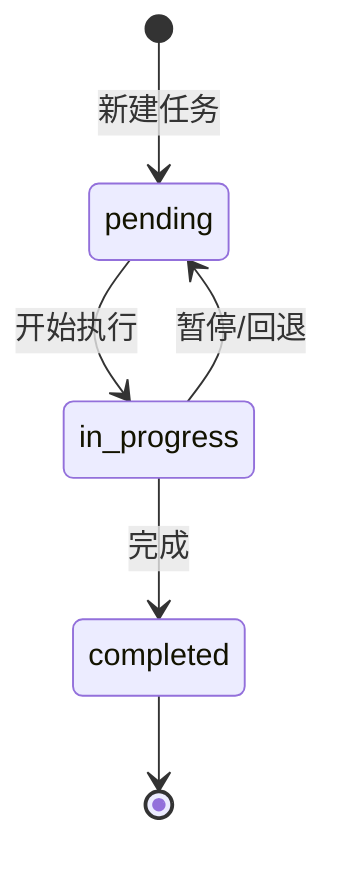

# Todo 工具

**文件：** `src/tools/todo.ts` · 66 行

Todo 工具让 agent 能够追踪多步任务的进度。它是一个有状态的单例，在整个会话期间维护一份任务列表。

## 核心代码

```typescript
export interface TodoItem {
  id: string;
  text: string;
  status: "pending" | "in_progress" | "completed";
}

export class TodoManager {
  private items: TodoItem[] = [];

  update(items: TodoItem[]): string {
    if (items.length > 20) {
      throw new Error("Max 20 todos allowed");
    }
    const validated: TodoItem[] = [];
    let inProgressCount = 0;

    for (const item of items) {
      // ... 验证 text、status ...
      if (status === "in_progress") inProgressCount++;
      validated.push({ id: itemId, text, status });
    }

    if (inProgressCount > 1) {
      throw new Error("Only one task can be in_progress at a time");
    }

    this.items = validated;
    return this.render();
  }

  render(): string {
    const marker = { pending: "[ ]", in_progress: "[>]", completed: "[x]" };
    const lines = this.items.map(item =>
      `${marker[item.status]} #${item.id}: ${item.text}`
    );
    const done = this.items.filter(t => t.status === "completed").length;
    lines.push(`\n(${done}/${this.items.length} completed)`);
    return lines.join("\n");
  }
}

export const TODO = new TodoManager();

export function runTodo(items: TodoItem[]): string {
  try {
    return TODO.update(items);
  } catch (e) {
    return `Error: ${e instanceof Error ? e.message : String(e)}`;
  }
}
```

## 三态状态机



| 状态 | 标记 | 含义 |
|------|------|------|
| `pending` | `[ ]` | 待办，尚未开始 |
| `in_progress` | `[>]` | 进行中，当前正在处理 |
| `completed` | `[x]` | 已完成 |

## 关键约束

### 约束 1：同时只能 1 个 `in_progress`

```typescript
if (inProgressCount > 1) {
  throw new Error("Only one task can be in_progress at a time");
}
```

这个约束强制 agent **串行执行任务**，而不是"假装并发"——实际上 agent 是单线程的，同时标记多个 in_progress 只会制造混乱。

### 约束 2：最多 20 个任务

```typescript
if (items.length > 20) {
  throw new Error("Max 20 todos allowed");
}
```

防止 todo 列表无限膨胀，保持 token 消耗可控。20 个任务对于一次 agent 会话来说已经很多了。

### 约束 3：`update` 是全量替换

每次调用 `todo` 工具，传入的是**完整的任务列表**，而不是增量更新。模型必须在每次调用时包含所有任务（含已完成的）。

这个设计的好处：状态完全由最后一次 `update` 决定，没有"删除操作"——通过不在下次列表里包含某项来隐式删除。

## 设计决策

### 为什么是单例 `TODO`？

```typescript
export const TODO = new TodoManager();
```

整个 agent 会话共享一个 todo 列表。如果是多实例，不同地方调用 `runTodo` 会操作不同的状态，无法追踪全局进度。

对于 CLI 工具（单进程、单会话），单例是正确的选择。

### `render()` 返回格式化字符串而不是 JSON

```
[>] #1: 分析项目结构
[ ] #2: 实现核心功能
[x] #3: 编写测试
(1/3 completed)
```

模型看到的工具结果是这段文本，而不是 JSON。格式化字符串比 JSON 更紧凑，也更符合模型对"任务列表"的理解（类似 Markdown 的 checklist 风格）。

### 验证在 `update` 里而不是在 `runTool` 里

验证逻辑（status 枚举、text 非空）放在 `TodoManager.update()` 里，`runTodo` 只做 try/catch。这样 `TodoManager` 是自包含的、可测试的——不依赖外部调用方来保证数据正确。

## 关键细节

- 任务 `id` 是字符串，不是自增数字——模型可以用任意字符串（"1", "setup", "a"）作为 id
- 状态变更的历史不被追踪——`TODO.items` 只保存当前快照
- 空 todo 列表调用 `render()` 返回 `"No todos."`，而不是空字符串
