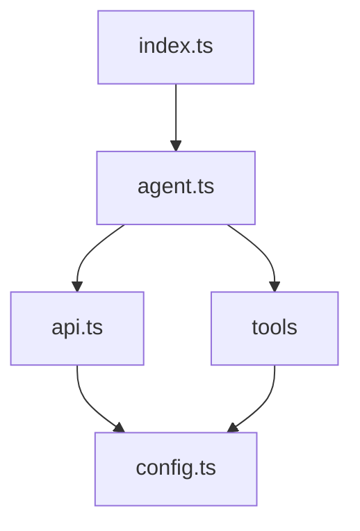
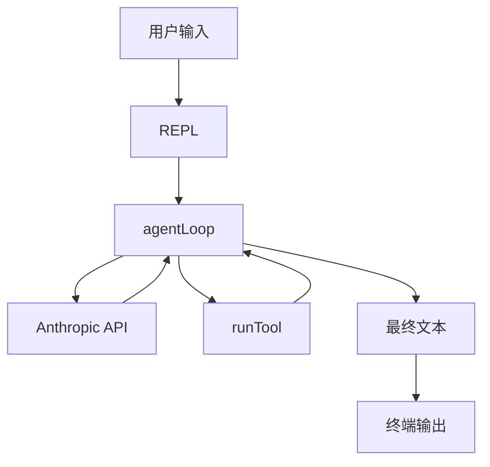

# 架构总览

Steven Agent 是一个 **240 行左右的 Coding Agent CLI**，用 TypeScript + Bun 实现。整个系统分为 5 层，各层职责清晰，依赖方向单向向下。

## 分层架构图



## 完整数据流



## 模块职责对照表

| 文件 | 职责 | 关键导出 |
|------|------|---------|
| `index.ts` | REPL 主循环，管理对话历史 | `main()` |
| `src/agent.ts` | Agent Loop，处理 tool_use 循环 | `agentLoop()` |
| `src/api.ts` | Anthropic SDK 初始化 | `client`, `Anthropic` |
| `src/config.ts` | 全局配置常量 | `MODEL`, `WORKDIR`, `SYSTEM` |
| `src/tools/index.ts` | 工具声明 + 分发器 | `TOOLS`, `runTool()` |
| `src/tools/bash.ts` | Shell 命令执行 | `runBash()` |
| `src/tools/files.ts` | 文件读写编辑 | `runRead()`, `runWrite()`, `runEdit()` |
| `src/tools/todo.ts` | 任务状态管理 | `TODO`, `runTodo()` |

## 依赖关系

```
index.ts
  └── src/agent.ts
        ├── src/api.ts
        │     └── (Anthropic SDK)
        ├── src/config.ts
        └── src/tools/index.ts
              ├── src/tools/bash.ts
              ├── src/tools/files.ts
              │     └── src/config.ts
              └── src/tools/todo.ts
```

`config.ts` 是唯一被多个模块共同依赖的叶节点，保持它的精简很重要。
