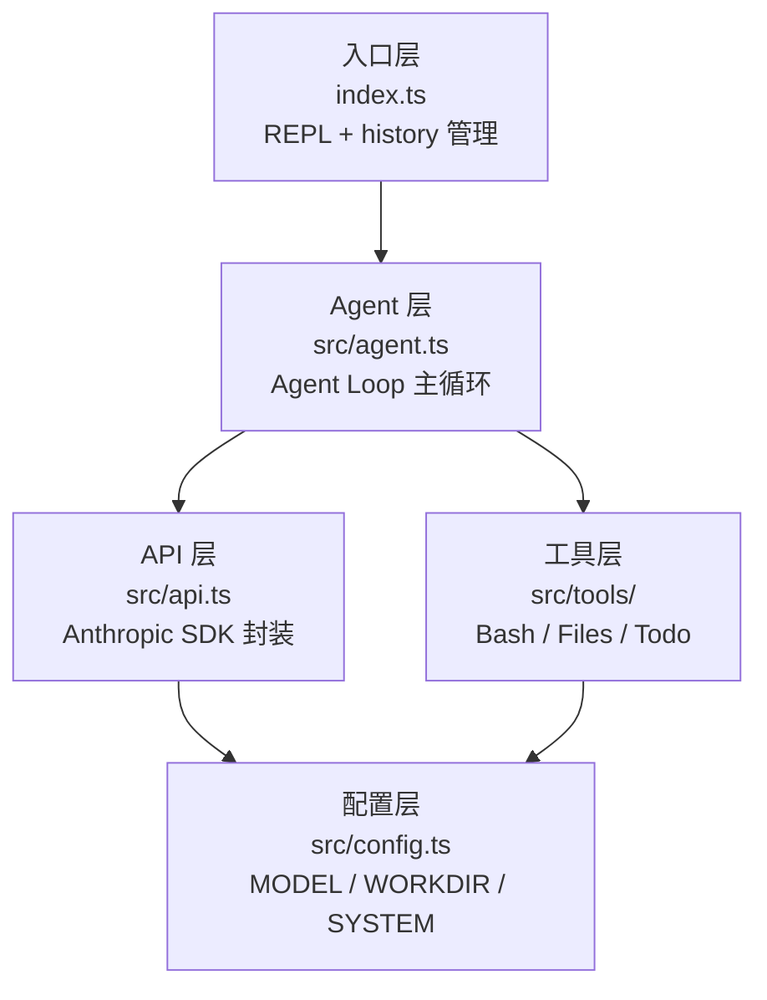

# 架构总览

Steven Agent 是一个 **240 行左右的 Coding Agent CLI**，用 TypeScript + Bun 实现。整个系统分为 5 层，各层职责清晰，依赖方向单向向下。

## 分层架构图



## 完整数据流

```mermaid
sequenceDiagram
    participant U as 用户
    participant REPL as REPL (index.ts)
    participant Loop as agentLoop
    participant API as Anthropic API
    participant Tool as runTool

    U->>REPL: 输入指令
    REPL->>Loop: history.push(user msg)<br/>agentLoop(history)
    loop 直到 stop_reason !== "tool_use"
        Loop->>API: messages.create(history, tools)
        API-->>Loop: response (text | tool_use blocks)
        Loop->>Loop: history.push(assistant response)
        alt stop_reason === "tool_use"
            loop 遍历 response.content
                Loop->>Tool: runTool(name, input)
                Tool-->>Loop: output string
            end
            Loop->>Loop: roundsSinceTodo 计数<br/>若 ≥3 则插入 reminder
            Loop->>Loop: history.push(user tool_results)
        else stop_reason !== "tool_use"
            Loop-->>REPL: return
        end
    end
    REPL->>U: 打印最后 text block
```

## 模块职责对照表

| 文件 | 职责 | 关键导出 |
|------|------|---------|
| `index.ts` | REPL 主循环，管理对话历史 | `main()` |
| `src/agent.ts` | Agent Loop，处理 tool_use 循环 | `agentLoop()` |
| `src/api.ts` | Anthropic SDK 初始化 | `client`, `Anthropic` |
| `src/config.ts` | 全局配置常量 | `MODEL`, `WORKDIR`, `SYSTEM` |
| `src/tools/index.ts` | 工具声明 + 分发器 | `TOOLS`, `runTool()` |
| `src/tools/bash.ts` | Shell 命令执行 | `runBash()` |
| `src/tools/files.ts` | 文件读写编辑 | `runRead()`, `runWrite()`, `runEdit()` |
| `src/tools/todo.ts` | 任务状态管理 | `TODO`, `runTodo()` |

## 依赖关系

```
index.ts
  └── src/agent.ts
        ├── src/api.ts
        │     └── (Anthropic SDK)
        ├── src/config.ts
        └── src/tools/index.ts
              ├── src/tools/bash.ts
              ├── src/tools/files.ts
              │     └── src/config.ts
              └── src/tools/todo.ts
```

`config.ts` 是唯一被多个模块共同依赖的叶节点，保持它的精简很重要。
